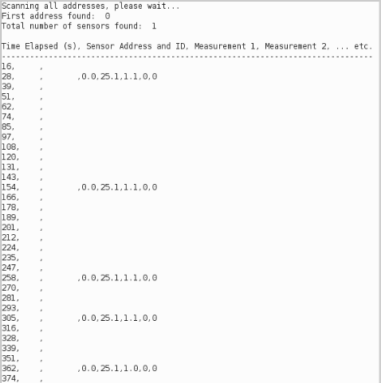

# acclima-tdr

Connecting an Acclima TDR310H to an Arduino-compatible datalogger.

## Summary

As of August 5, 2019: we've successfully connected to the sensor using an open source library and retrieved preliminary data.  Next steps include:

- Stabilizing the return signal so that measurements are retrieved every X seconds (perhaps this only requires a stable screw terminal connection in lieu of e.g. a breadboard);
- Writing code to return only a single set of measurements at a time (rather than the current code, which runs on a loop)
- Reviewing the voltage signal level output by the sensor

## Power requirements for the sensor

From the TDR310H Data Sheet ([in this repo](./references/TDR310H-Data_Sheet.pdf) and [online](https://acclima.com/prodlit/Acclima%20TDR310H%20Data%20Sheet.pdf)):


## Expected data from the sensor

From the TDR310H Data Sheet ([in this repo](./references/TDR310H-Data_Sheet.pdf) and [online](https://acclima.com/prodlit/Acclima%20TDR310H%20Data%20Sheet.pdf)):


## Wiring to a microcontroller

From the Installation Manual ([in this repo](./references/TDR-315-User-Manual.pdf) and [online](http://au.ictinternational.com/content/uploads/2017/04/TDR-315-User-Manual.pdf)): 


## Code for a microcontroller

We'll use the [EnviroDIY SDI-12 Library](https://github.com/EnviroDIY/Arduino-SDI-12), installed on an Adafruit Feather M0.  We'll power the sensor (which requires at least 3.5 volts) with the USB pin (5V).  

**Note: not sure if the signal data is 3.3 volts or 5 volts, need to check.**

Using the [d_simple_logger.ino](https://github.com/EnviroDIY/Arduino-SDI-12/tree/master/examples/d_simple_logger) example from the library; simply modify the "DATA_PIN" variable to pin 6 on line 78:

```
#define DATA_PIN 6         // The pin of the SDI-12 data bus
```

This code should print values out to the serial port. The suitably modified code is [here](https://github.com/edgecollective/acclima-tdr/blob/master/code/d_simple_logger.ino)).

## Test Setup

We'll test the setup in a beaker of water:


## Data Results

Initial connection to the device worked within a few seconds.  For some reason, the sensor output data with stochastic time intervals between measurements. This may have been due to poor wiring connections on the breaboard.



You can see the 5 reported values, as predicted in the above table: 

- Volumetric Water Content
- Soil Temperature 
- Bulk Relative Permittivity
- Soil Electric Conductivity
- Soil Pore Water EC

Before the probe is placed in water, the only non-zero values are for the temperature (25.1 C), and the Bulk Relative Permittivity (1.1).  


We then readjusted the wires slightly, and  performed a test in which the probe was dipped into the beaker in stages, with more of the prongs wetted over time; it was then removed, and then returned to the beaker.  The values changed as expected, and were reported more consistently (every 10 seconds or so):

