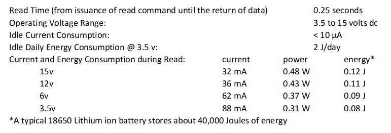
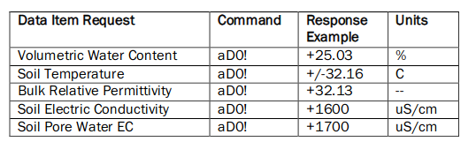
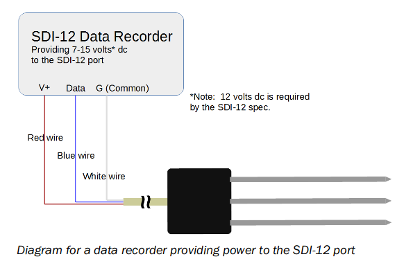
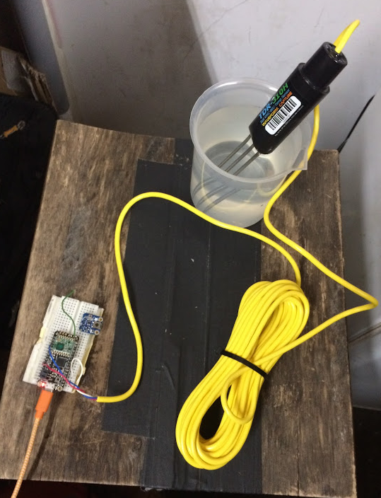
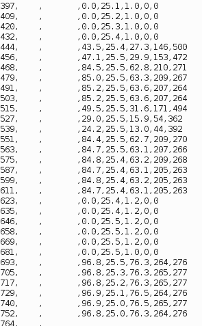

# acclima-tdr

From the TDR310H Data Sheet ([in this repo](./references/TDR310H-Data_Sheet.pdf) and [online](https://acclima.com/prodlit/Acclima%20TDR310H%20Data%20Sheet.pdf)):

From the Installation Manual ([in this repo](./references/TDR-315-User-Manual.pdf) and [online](http://au.ictinternational.com/content/uploads/2017/04/TDR-315-User-Manual.pdf)): 

[EnviroDIY SDI-12 Library](https://github.com/EnviroDIY/Arduino-SDI-12) for Arduino

